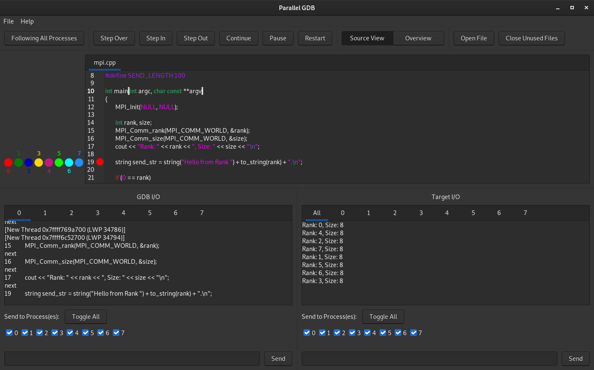

# Parallel GDB
This program is for debugging parallel programs either on the local machine or on a remote cluster using SSH. It provides support to launch the processes via mpirun and srun.

# Structure
This debugger consists of two parts: 
1. The GUI master running on the host machine (See screenshot)
2. The slaves running on the host machine or the remote cluster

# Building
To build these two separate executables, you can use the following command from the top level directory.

	mkdir bin
	make

This will generate a `pgdb` and a `pgdbslave` executable in the `bin` directory. Use

	make install

to install these binaries into `/usr/local/bin`. If you only want a specific executable you can run 

	make master

or 

	make slave

to get the corresponding executable. Use

	make clean

to delete all generated files. To delete the executables from the `/usr/local/bin` directory run

	make uninstall

# Dependencies
## Compile-Time
The following dependencies must be available for building the master:
- libgtkmm-3.0
- libgtksourceviewmm-3.0
- libssh

On Debian based systems, you can use the following command to install them:

	apt install libgtkmm-3.0-dev libgtksourceviewmm-3.0-dev libssh-dev

To build the slave only C++ standard libraries are needed.

## Run-Time
For the debugger to work, the following programs need to be installed and be available in the $PATH environment variable of the master/slave:
- mpirun: To start the slave instances using MPI. (master)
- srun: To start the slave instances using slurm. (master)
- GDB: To debug the target program. (slave)
- socat: To handle the I/O of the GDB instance and the target instance. (slave)

Furthermore, when debugging on a remote cluster, the `pgdbslave` executable needs to be copied to or build on this machine.

# Using the debugger
When installed (and `/usr/local/bin` is included in the $PATH environment variable) the debugger is started by:

	pgdb

or by searching for it in the desktop application menu. If the debugger is only built it can be run with 

	./bin/pgdb

In the startup dialog you need to set the path to the `pgdbslave` and `target` executable, as well as some other parameters. This configuration can be exported and imported at the next start.

The master will start the specified number of slaves, each of which will start the GDB instance, running the target program, and two socat instances, handling the I/O of GDB and the target.

If SSH is enabled, the master logs on to the remote cluster and starts the slaves there.

## Custom launcher command
If you need to make specific changes to the start command, or need to use a completely different launcher, you can check the "custom" launcher option in the startup dialog. This command will invalidate all configurations except for the SSH options, the Number of Processes and the Base Port. For the master to know how many connections to open the Number of Processes still needs to be set in the startup dialog. Make SURE they match up with what you set in your custom command.

If Parallel GDB should not start the slaves at all, check the "custom" launcher option and leave the Launcher Arguments blank.

The slave supports two possibilities to set its rank and the size. Under normal conditions it will try to read the environment variables set by OpenMPI/PMI:

	OMPI_COMM_WORLD_RANK
	OMPI_COMM_WORLD_SIZE

	PMI_RANK
	PMI_SIZE

If the launcher you are using is not setting those environment variables, you can specify custom environment variable names for the rank and size:

	-k <name> # rank
	-z <name> # size

To directly pass the rank or size to the slave use:

	-r <rank>
	-s <size>

The rank must be set for every slave individually, so the launch command should probably start a shell script/etc.

# Example Target
In this project a small example target and configuration file for it is included. It can be built with:

	cd example
	mkdir bin
	make

After that the debugger can be started with:

	cd ..
	./bin/pgdb

Then, in the startup dialog, load the configuration file `config` from the `example` folder and customize it to your needs.